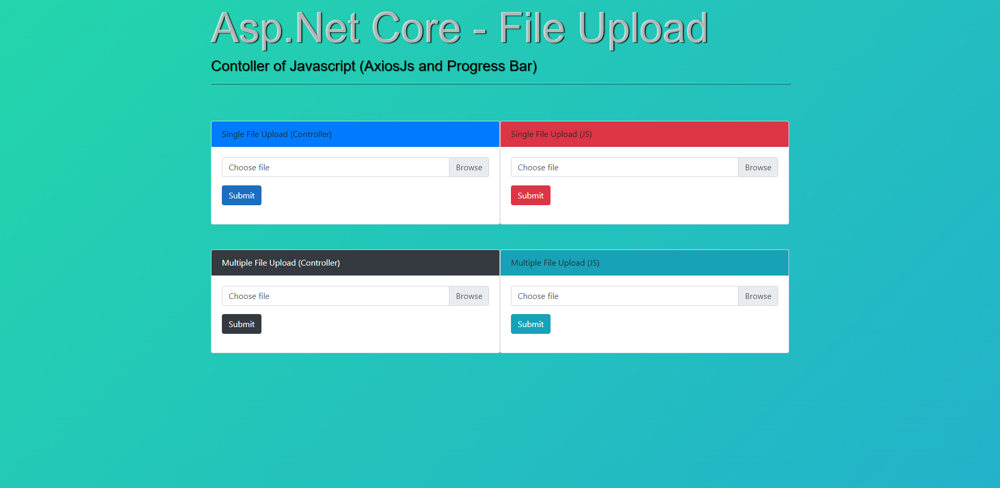

# Asp.net Mvc - File Upload Tutorials
>  Asp.net Core - File Upload with AxiosJs and Progressbar

## Table of contents
* [General info](#general-info)
* [Screenshots](#screenshots)
* [Technologies](#technologies)
* [Code Examples](#code-examples)

## General info
You can make modern and effective projects by using jquery and dropzone libraries.

## Screenshots


## Technologies
* .NET Framework 4.6.1+
* .NET Standard 3.1, providing .NET Core support
* Install latest version of Visual Studio : https://www.visualstudio.com/downloads/
* Nuget DropzoneJS : https://www.nuget.org/packages/dropzone/
* Nuget Microsoft jQuery Unobtrusive Ajax : https://www.nuget.org/packages/Microsoft.jQuery.Unobtrusive.Ajax/
* Axios Progress Bar - https://github.com/rikmms/progress-bar-4-axios

## Code Examples
Show examples of usage:
```
$('#SinglePostJsBtn').click(function () {
                $('#SinglePostJsBtn').prop('disabled', true);
                var singleData = new FormData();
                singleData.append('file', $('#JsSingleFile')[0].files[0]);
                axios.post("/Home/SingleFile", singleData)
                    .then(
                        $('#SinglePostJsBtn').prop('disabled', false),
                        Success()
                    ).catch(function (err) {
                        console.log(err.message);
                    });
            });
            $('#JsSingleFile').on('change', function () {
                var file = $('#JsSingleFile')[0].files[0];
                $(this).next().text(file.name);
            });
```

